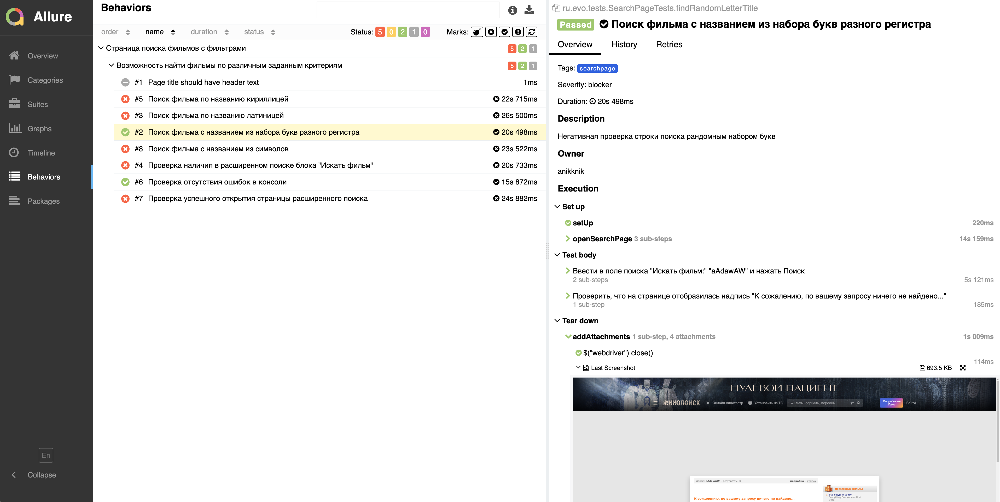

# Пример автоматизации поисковой страницы сервиса Кинопоиск

## :page_with_curl:    Содержание

➠ [Покрытый функционал](#globe_with_meridians-покрытый-функционал)

➠ [Технологический стек](#computer-технологический-стек)

➠ [Запуск тестов из терминала](#technologist-запуск-тестов-из-терминала)

➠ [Удаленный запуск тестов](#удаленный-запуск-тестов)

➠ [Сборка в Jenkins](#Jenkins_sborka)

➠ [Отчет о результатах тестирования в Allure Report](#Allure_report)

➠ [Уведомления в Telegram с использованием бота](#Telegram_report)

➠ [Пример запуска теста в Selenoid](#selenoid_video)
## <a name="globe_with_meridians-покрытый-функционал"></a>:globe_with_meridians: Покрытый функционал

### UI

:white_check_mark: Проверка успешного открытия страницы расширенного поиска
:white_check_mark: Проверка наличия в расширенном поиске блока "Искать фильм"
:white_check_mark: Поиск фильма по названию кириллицей
:white_check_mark: Поиск фильма по названию латиницей
:negative_squared_cross_mark: Поиск фильма с названием из набора букв разного регистра
:negative_squared_cross_mark: Поиск фильма с названием из символов 
:white_check_mark: Проверка отсутствия ошибок в консоли
:ballot_box_with_check: Page title should have header text

:white_check_mark: - позитивные кейсы
:negative_squared_cross_mark: - негативные кейсы
:ballot_box_with_check: - пропущенные (требуется доработка)

## :computer: Технологический стек

<p align="center">


</p>

## :technologist: Запуск тестов из терминала

### Локальный запуск тестов

```
gradle clean searchpage
```

### Удаленный запуск тестов

```
clean
searchpage
-Dbrowser=${BROWSER}
-DbrowserVersion=${BROWSER_VERSION}
-DbrowserSize=${BROWSER_SIZE}
-Dremote=${REMOTE_URL}
```

### Параметры сборки

> <code>BROWSER</code> – браузер, в котором будут выполняться тесты (_по умолчанию - <code>chrome</code>_).
>
> <code>BROWSER_SIZE</code> – размер окна браузера, в котором будут выполняться тесты (_по умолчанию - <code>1920x1080</code>_).
>
> <code>BROWSER_VERSION</code> – версия вебдрайвера браузера (_по умолчанию - <code>99</code>_).
>
> <code>REMOTE_URL</code> – адрес удалённого стенда для запуска браузера.

##  Главная страница сборки [Jenkins](https://jenkins.autotests.cloud/job/12-anikknik-homework13/)

<p align="center">
  
</p>

##  Отчет о результатах тестирования в [Allure Report](https://jenkins.autotests.cloud/job/12-anikknik-homework13/allure/)

### :pushpin: Стартовая страница Allure-отчета

<p align="center">

</p>

### :pushpin: Вид тест-кейсов

<p align="center">

</p>

### :pushpin: Графики тест-ранов

<p align="center">

</p>

##  Репорт в Telegram с помощью бота

> После завершения сборки бот, созданный в <code>Telegram</code>, автоматически обрабатывает и отправляет сообщение с отчетом.
<p align="center">


</p>

##  Пример запуска теста в Selenoid

> К каждому тесту в отчете прилагается видео. Одно из таких видео представлено ниже.
<p align="center">
  
</p>

:black_heart: <a target="_blank" href="https://t.me/anikknik">t.me/anikknik</a>
